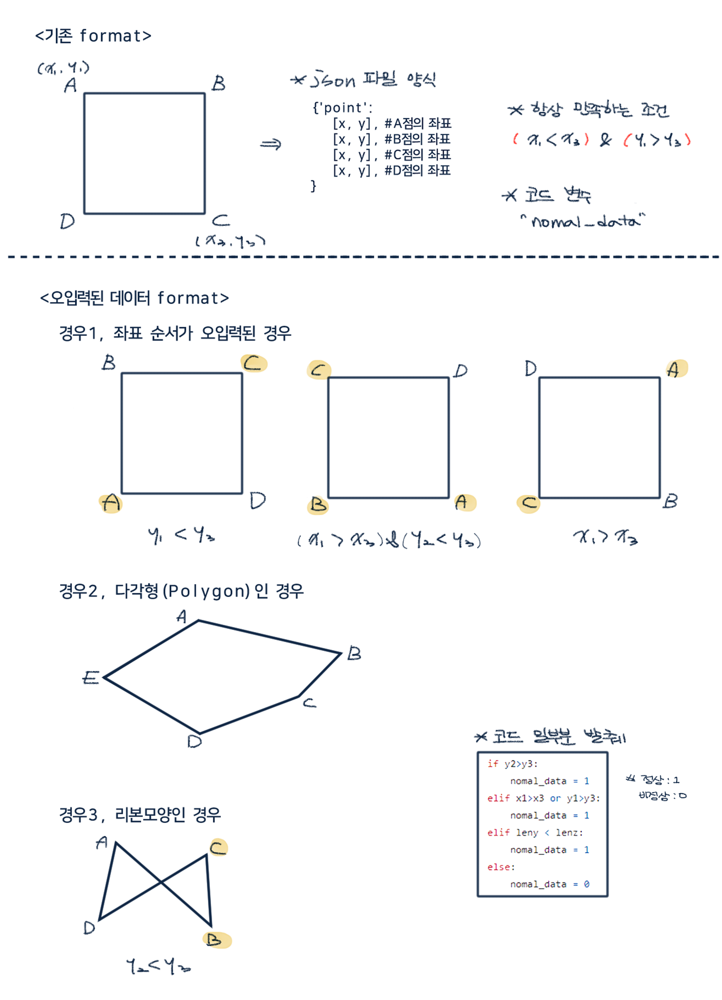

# Issue
```
- 좌표가 오입력된 경우
- 다각형인 경우
- 리본모양인 경우
- 왜곡이 심한 경우
- 저화질인 경우
```

## code
1. jpg_size
    * 저화질의 사진을 제거하기 위한 기능
    * 오름차순 정렬

2. nomal_data
    * 약속된 포맷과 다른 방식의 좌표값을 찾아내는 기능
    * 사각형 모양이 아닌 것 제거
    
3. seta_data
    * 사각형의 기울기를 구하는 기능
    
4. rank
    * 정상여부판단>기울기>화질 순으로 정렬해 순위가 높을수록 noisy data

<br>

## **🔥 성장경험**

- 값의 오입력 issue를 해결하기 위하여 다양한 방법을 연구하며, 가장 중요한 것은 한번에 깔끔히 문제를 해결하려 노력하기보다 큰 공통 분모를 찾고 세세한 부분을 조건문으로 조정하는게 코드도 깔끔하고, 혹여 놓쳤을 예외를 처리하기에도 쉬워진다는 점을 알게됨
- 사각형의 왜곡 정도를 알기 위하여 어떤 좌표, 어떤 각도를 target으로 하였을 때가 가장 왜곡 정도를 알기 쉬울지 다양하게 코드를 짜봄 (결과 : B좌표)

<br>
<br>

# 오입력 예시
